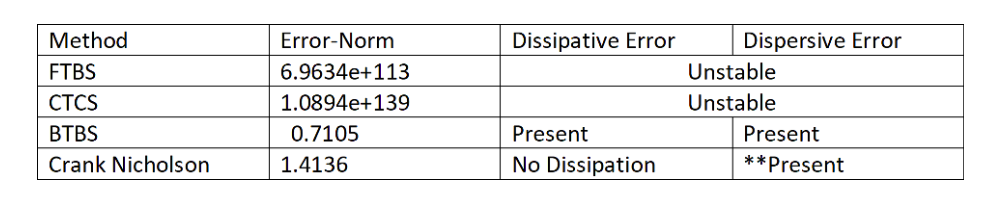

# CFD Code Repo   
---

This repo contains the basic CFD Codes for 1D and 2D Problem (Stationary and time dependent problem)

## 2D Elliptic and Parabolic PDE's
---

$u_t - \epsilon \Delta u = f$

### Heat Transfer Problem 

$u_t - \epsilon \Delta u = f$  

$u = 0$ at $y=1$

### Periodic Forcing Function

$u_t - \epsilon \Delta u = f$  

$u = 0$ on all Boundaries

$f(x,y,t) = sin( 2\pi x) * sin(2 \pi y) * sin(2 \pi t)$

---
---

## 1D hyperbolic PDE
---

$u_t + \alpha u_x  =f$

The stability of the following schemes have beeb studied for various CFL numbers
* Crank Nicholson
* FTBS - Forward in Time , Backward in Space
* BTBS - Backward in Time, Backward in Space (Implicit)
* CTCS - Central in Time Central in Space (Leap Frog)

### **CFL = 0.5**
---

#### Crank Nicholson

#### FTBS

#### CTCS

#### BTBS

#### Summary :

### **CFL = 1**
---

#### Crank Nicholson

#### FTBS

#### CTCS

#### BTBS

#### Summary :

### **CFL = 2**
---

#### Crank Nicholson

#### FTBS

#### CTCS

#### BTBS

#### Summary :

### **Overall Plot**

